# MyiHome

分析：[项目需求分析](Analysis.md)

展示：[项目整体功能展示](show.md)

## 1、系统架构
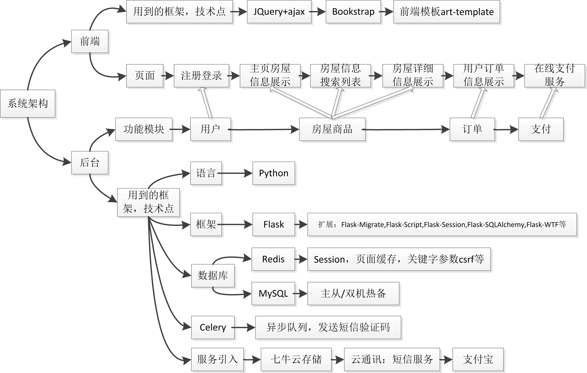

## 2、项目采用前后端分离模式
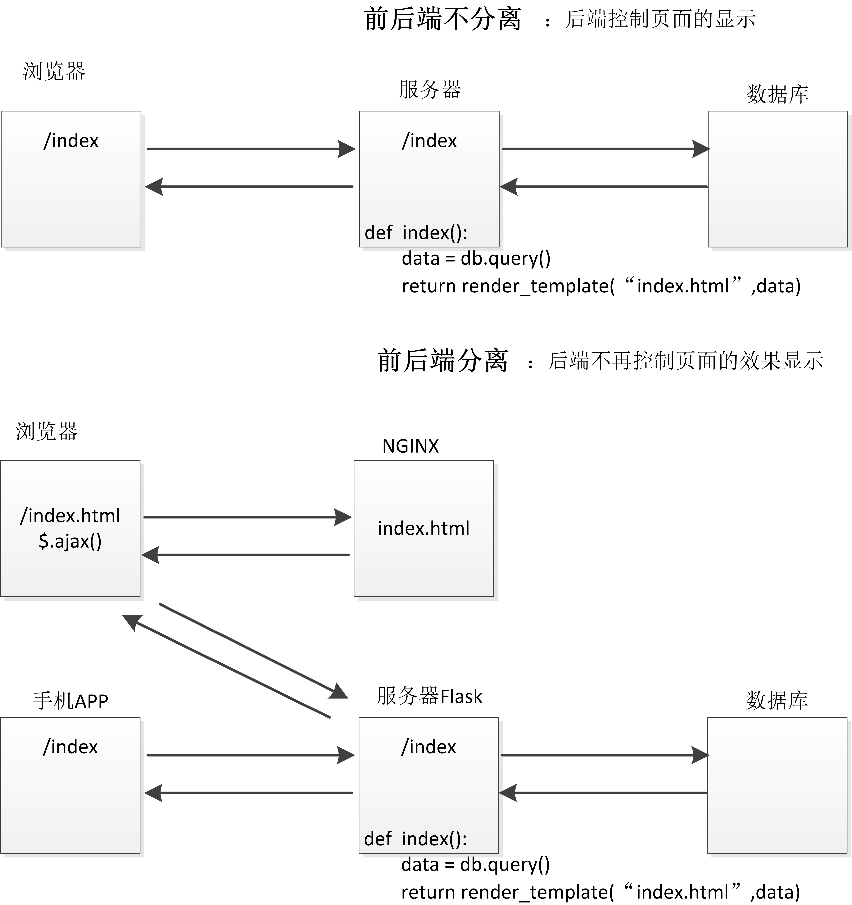

## 3、数据库表关系及结构设计
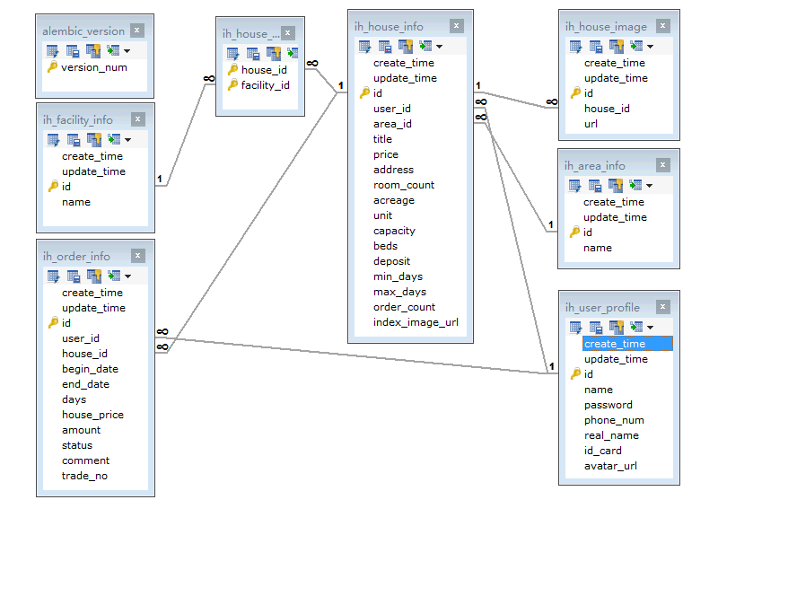

## 4、短信验证码注册实现原理
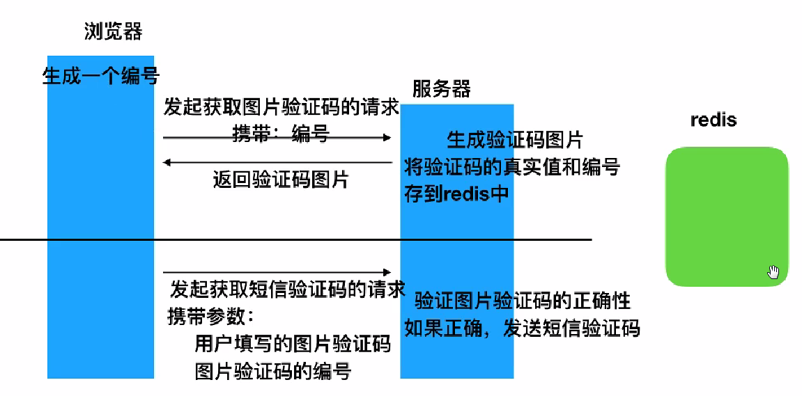

## 5、celery 实现异步队列处理任务原理
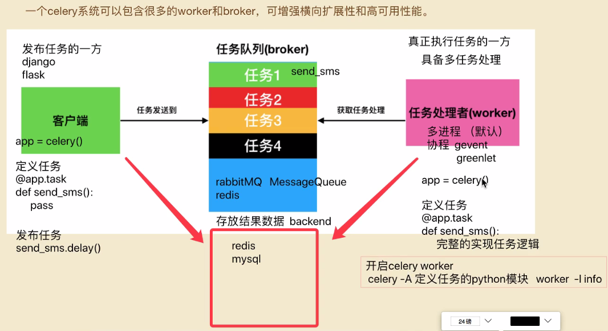

## 6、session跨服务器访问原理
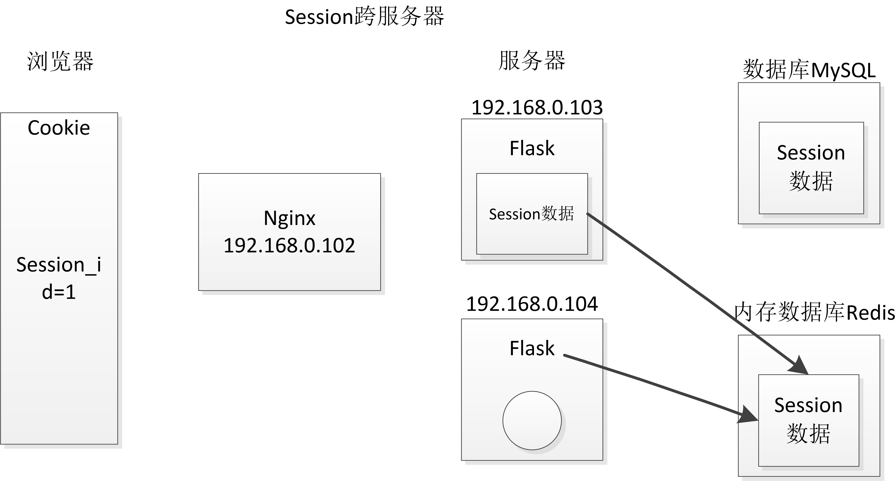

## 7、csrf 验证机制原理
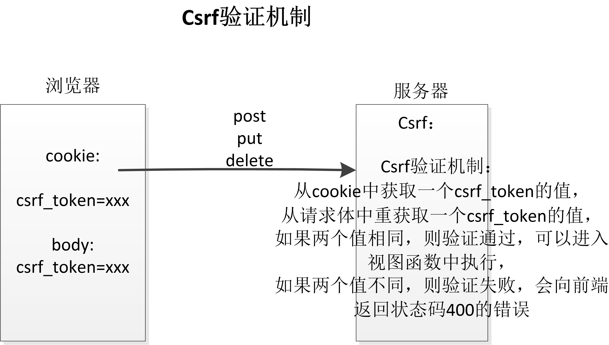
**注：** body是请求体（req_body），不是标签的body

## 8、csrf漏洞攻击原理
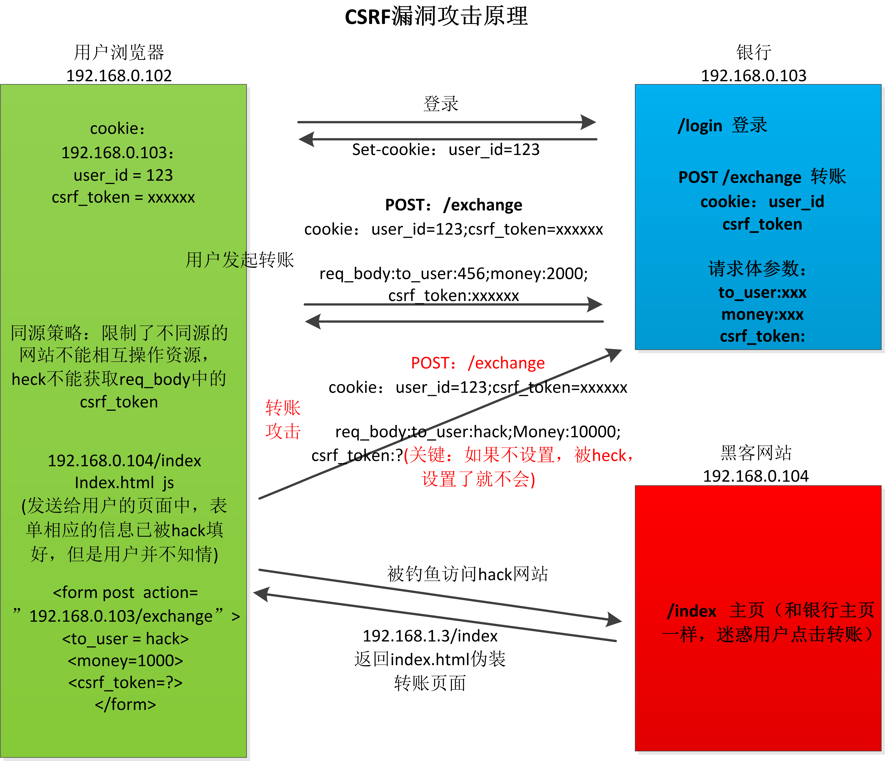

## 9、缓存使用的原理
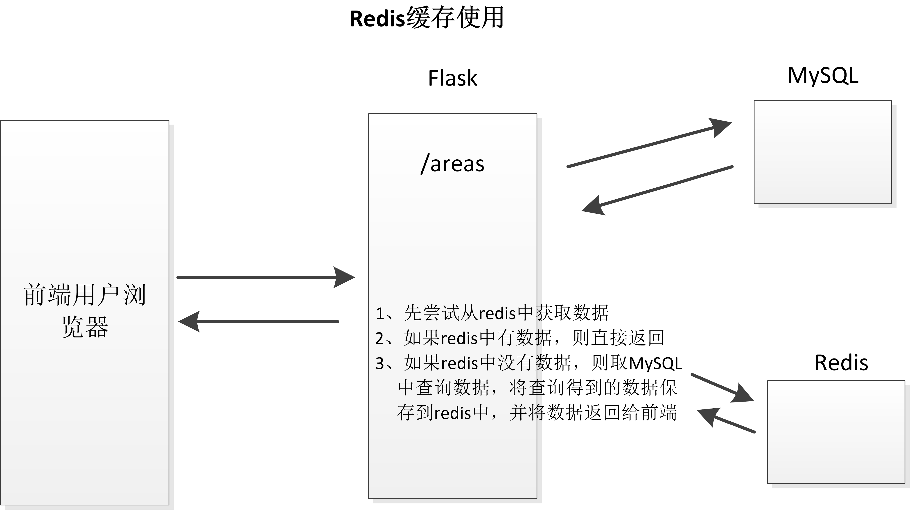

## 10、mysql数据库优化
**1.主从同步**

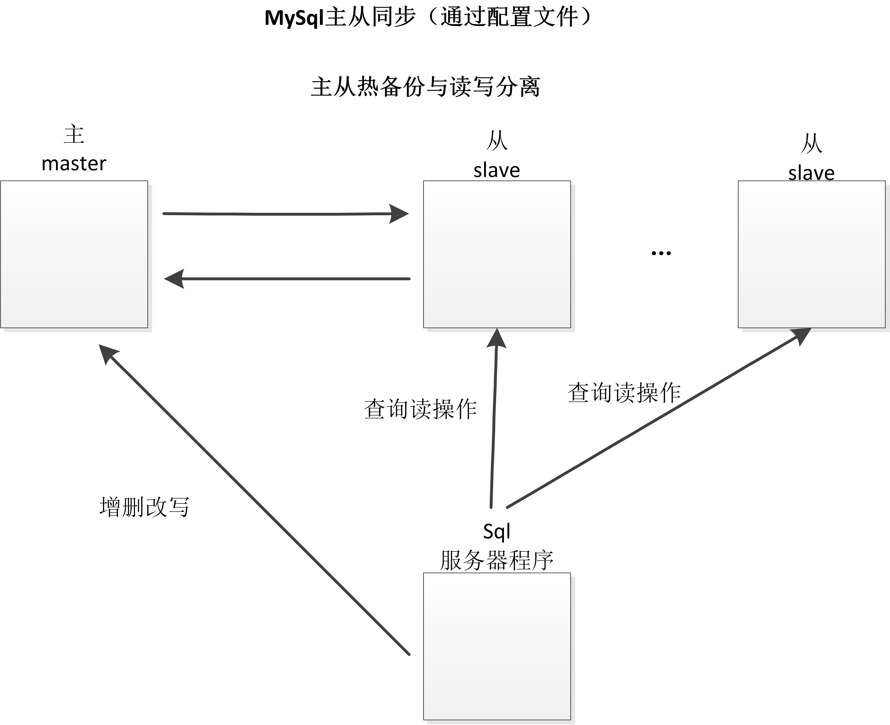

**2、添加索引加快的原理（有极限）**

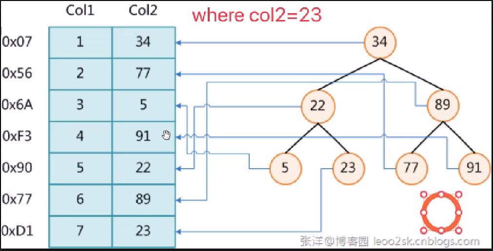

## 11、项目部署
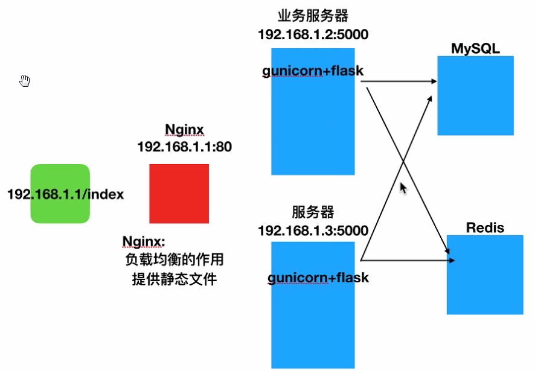
