# MyiHome 项目图片展示

**从用户注册登录跳转到首页显示、订房、添加订单到支付完成，租后评论**

**以及我的信息完善和实名认证和新房源的发布**

## 注册
* 注册后默认跳转到首页

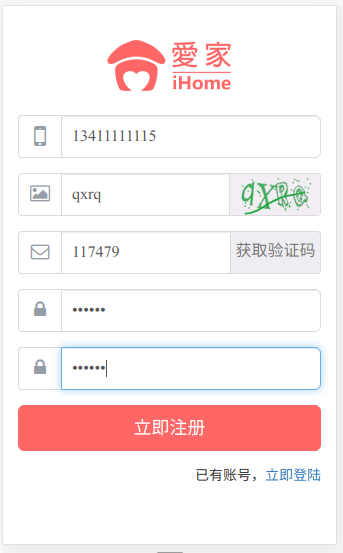
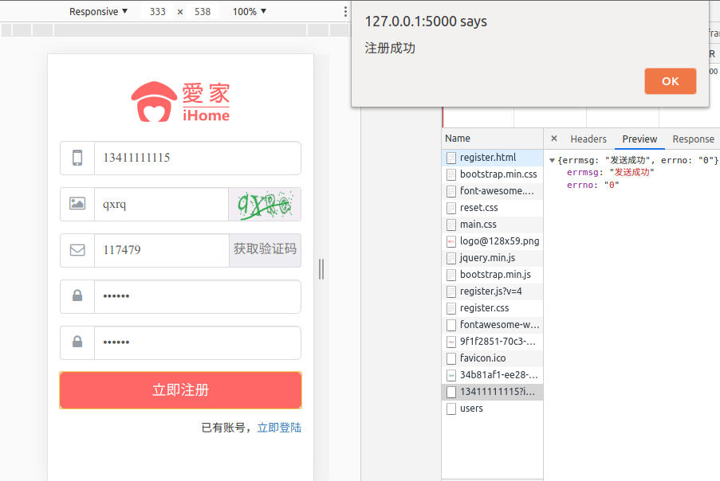

## 登录
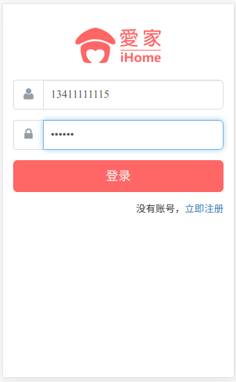

## 首页展示
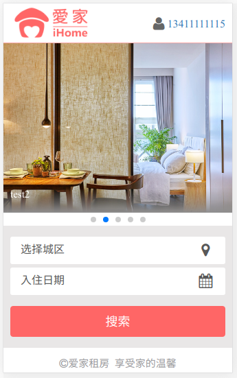

## 房屋搜索
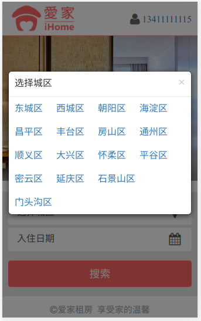
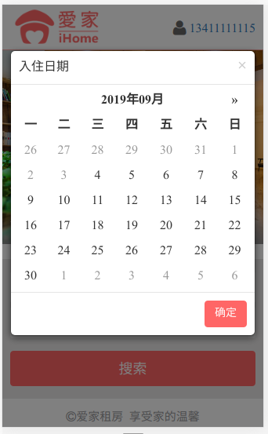
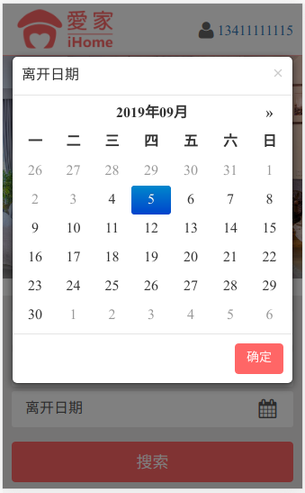
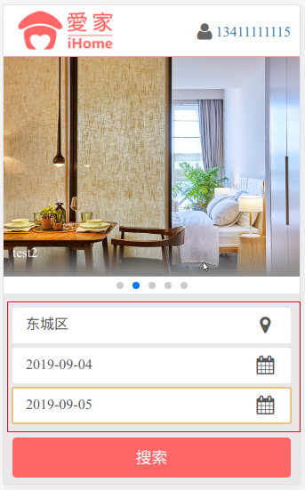

## 房屋列表
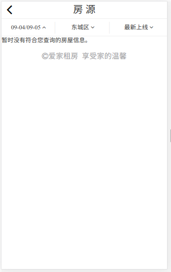

换个城区

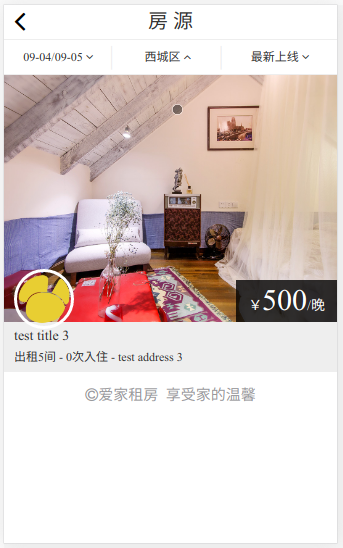

## 房屋详情
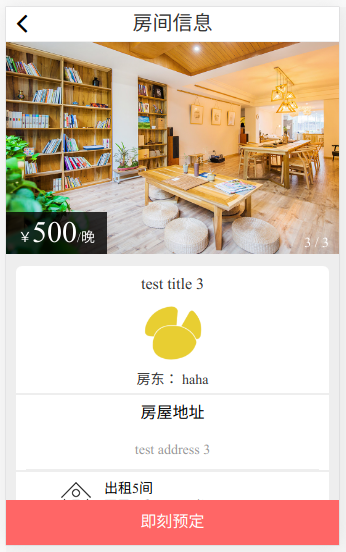
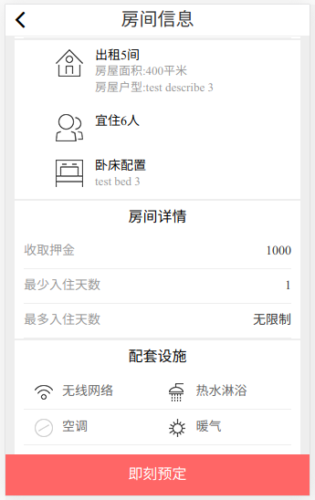
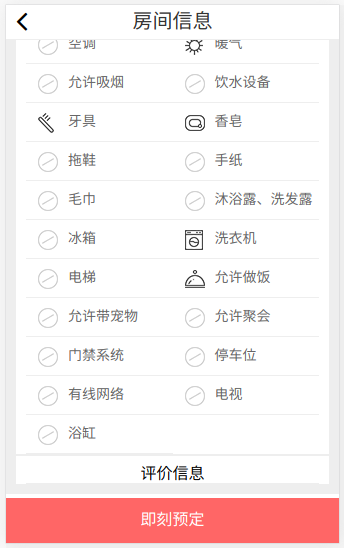

## 预订房子
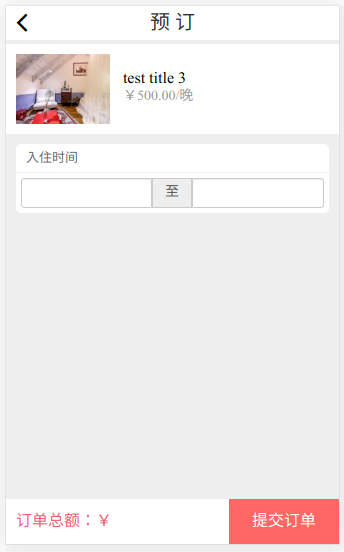

## 选择入住和离开日期
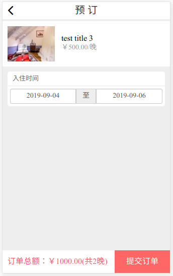

**这里应该是三晚的，前端已更改**

## 订单展示
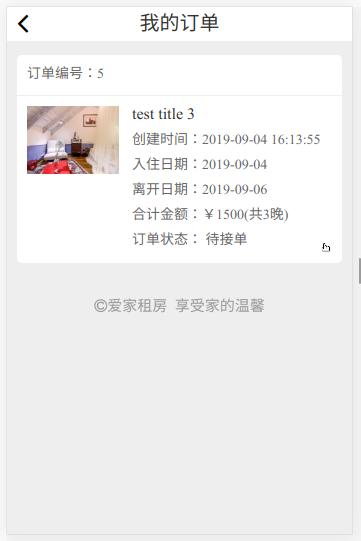

更换房东身份登入

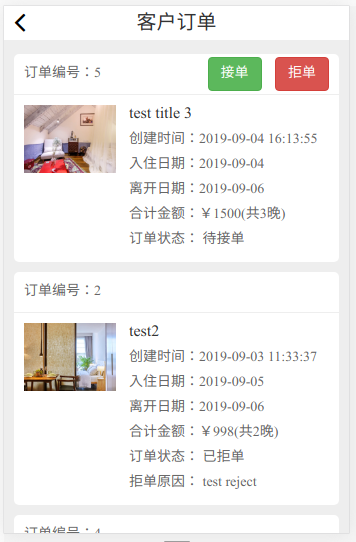
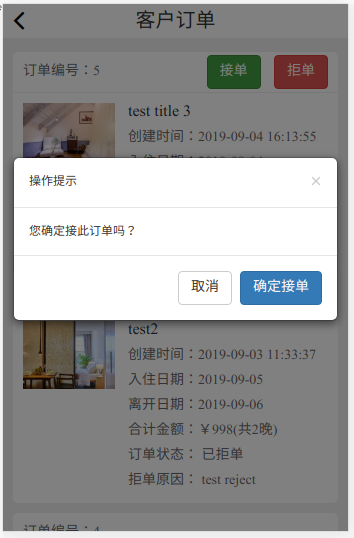
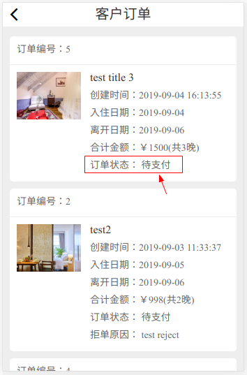

更换用户身份

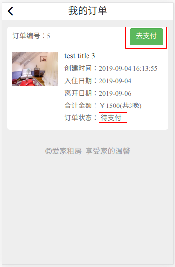

## 在线支付
点击去支付：

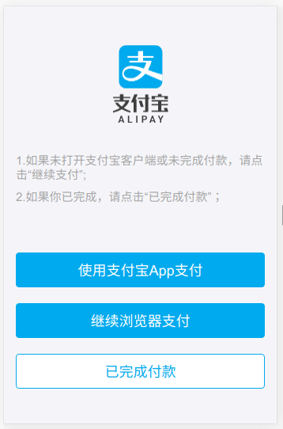

选择 **继续浏览器支付**

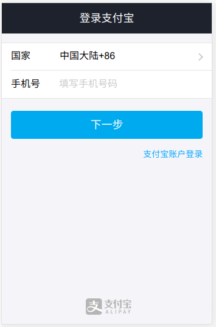
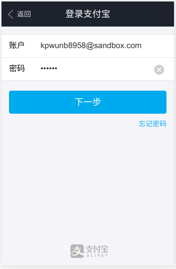
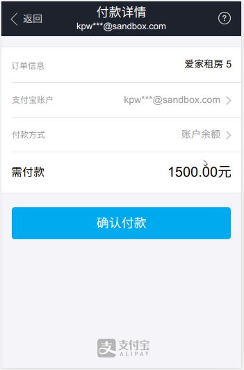

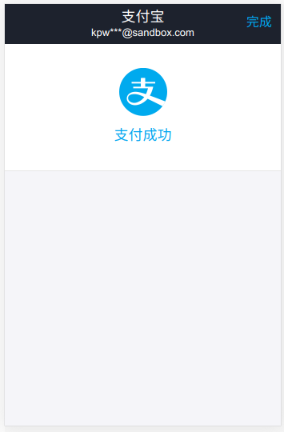

## 支付完成中转页，异步修改后端数据
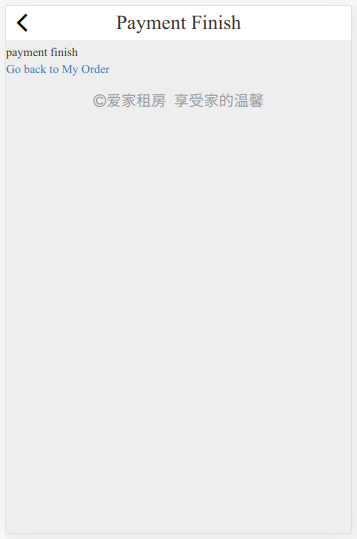

## 支付完成返回订单页面

## 点击租后评论
(假定用户已经入住完成)

更换房东身份

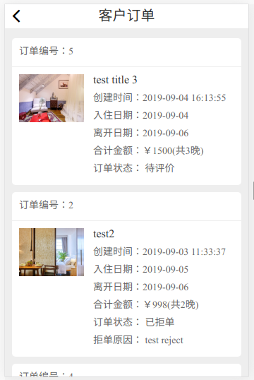

更换回用户身份

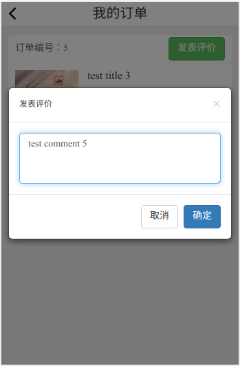
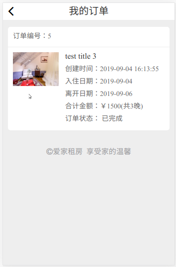

更换房东登入

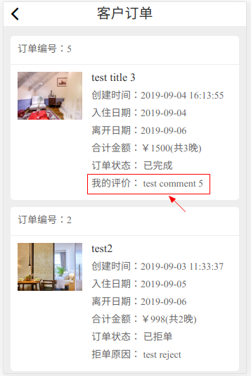

## 用户个人信息页
个人信息未修改页面

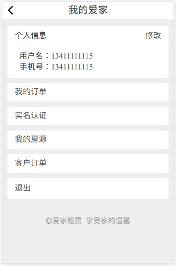
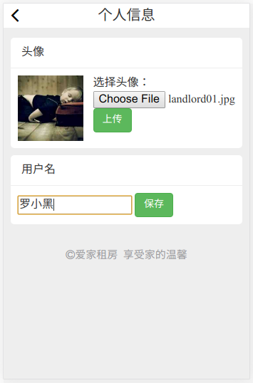
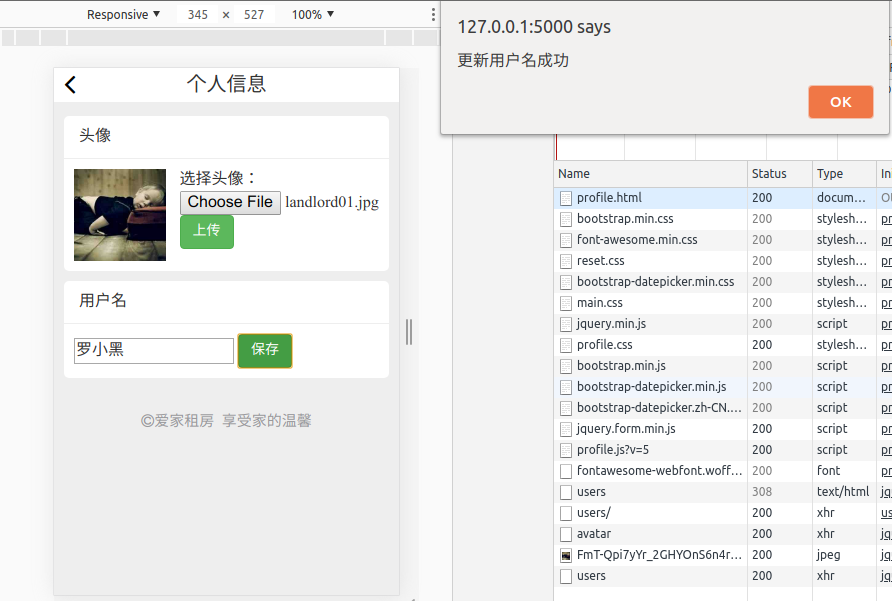
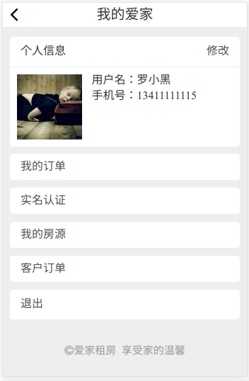

## 先要实名认证才能发布新房源

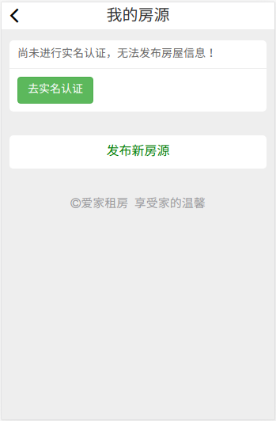
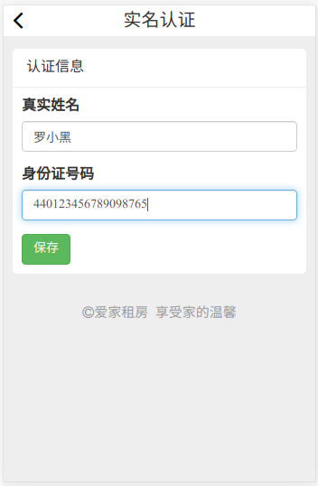
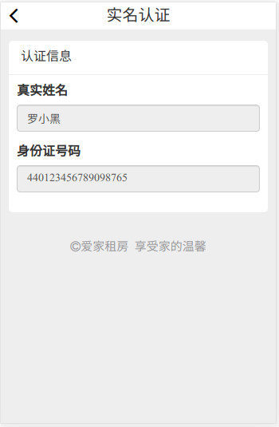

## 发布房源
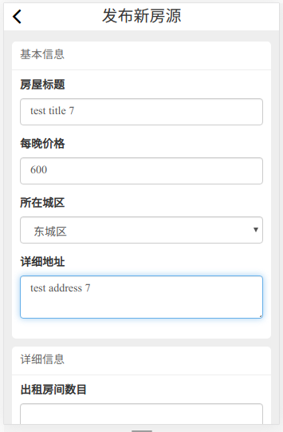
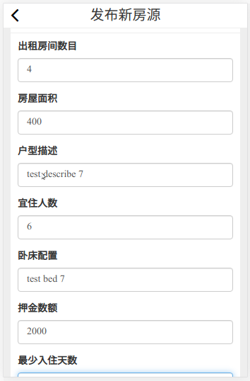
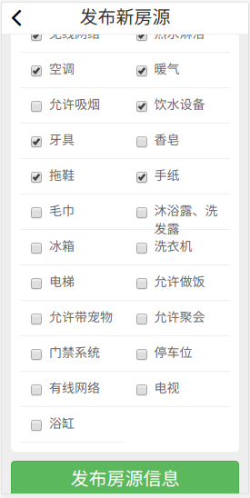
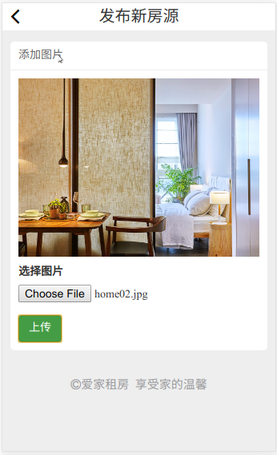
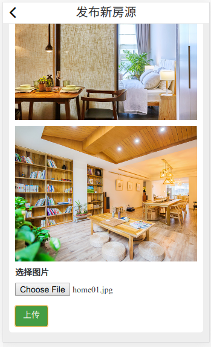

## 验证发布房源信息
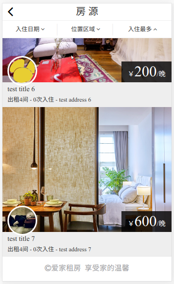

